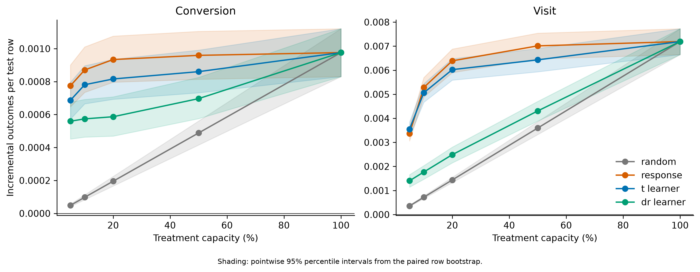

# Budget-Constrained Uplift Modelling and Causal Policy Optimization

This repository evaluates whether causal targeting improves incremental conversions over response-based targeting when only a fixed fraction of users can receive treatment.

The study uses 13,979,592 records from the official randomized `CRITEO-UPLIFTv2` dataset and its corrected `v2.1` artifact. It treats `treatment` as the randomized intention-to-treat assignment and excludes the post-assignment `exposure` field from every model.

[Paper (PDF)](paper/main.pdf) · [LaTeX source](paper/main.tex) · [Canonical results](results/) · [Interactive explorer](#interactive-explorer)

## Key results

- The complete-source conversion average treatment effect was **0.1152 percentage points** (95% confidence interval 0.1085 to 0.1219). The visit effect was 1.0342 percentage points (1.0056 to 1.0629).
- At 10% capacity, treated-response ranking exceeded expected random allocation by **77.3 estimated incremental conversions per 100,000 eligible test users** (pointwise 95% interval 65.1 to 90.0). It also exceeded the T-learner by 9.0 (1.8 to 15.3) and the doubly robust learner by 29.7 (21.8 to 37.5).
- Treated-response ranking had the highest held-out conversion policy-value estimate at every constrained capacity tested (5%, 10%, 20%, and 50%). At 100%, all policies are identical by construction.

The capacities and reported policy contrasts were fixed before evaluation. The contrasts use 1,000 paired row-bootstrap replicates and are pointwise, conditional on the fitted models. These are offline estimates on the released benchmark, not realized campaign outcomes.



## Method

Four allocation rules are compared at capacities of 5%, 10%, 20%, 50%, and 100%:

- expected uniform random allocation;
- response ranking by predicted conversion under treatment;
- a T-learner treatment-effect score; and
- a cross-fitted doubly robust learner.

Models are selected on train and validation data. The final comparison uses held-out augmented inverse-probability-weighted policy value, paired row-bootstrap intervals, and a separately computed fixed-propensity IPW Qini ranking diagnostic. Capacity denotes equal-cost user slots, not a monetary budget: the public data contain neither treatment costs nor conversion values.

## Reproduce

Python 3.11 through 3.13 is supported. LightGBM requires an OpenMP runtime; on macOS this is commonly installed with `brew install libomp`.

```bash
python3 -m venv .venv
source .venv/bin/activate
python -m pip install -e ".[dev]"
python scripts/download_data.py
uplift-policy prepare --config configs/analysis.yaml
uplift-policy train --config configs/analysis.yaml
# Commit the generated results/manifests/model_freeze.json, then continue
uplift-policy evaluate --config configs/analysis.yaml
pytest -q
```

The downloader verifies the official file's byte size, SHA-256 checksum, gzip integrity, row count, and ordered schema. See [data/README.md](data/README.md) for provenance and licensing.

Evaluation deliberately requires a clean working tree and an exact tracked copy of the model-freeze manifest. This makes the fitted-model hashes, training commit, selected boosting rounds, and software versions auditable before held-out outcome columns are loaded for evaluation or joined to frozen predictions. Model binaries remain local.

## Outputs

The analysis writes aggregate tables, figures, model and run manifests under `results/`. Row-level predictions, fitted model files, processed Parquet data, and the raw dataset remain outside Git. The Streamlit application reads the committed aggregate outputs and does not recompute statistics.

- [Average treatment effects](results/tables/average_treatment_effects.csv)
- [Held-out policy values](results/tables/policy_values.csv)
- [Paired policy contrasts](results/tables/policy_contrasts.csv)
- [Qini coefficients](results/tables/qini_coefficients.csv)
- [Run manifest](results/run_manifest.json)

## Interactive explorer

```bash
streamlit run app.py
```

The explorer is read-only: it displays the committed aggregate results and never loads the raw user-level data.

## Paper

The repository includes the [compiled paper](paper/main.pdf), [LaTeX source](paper/main.tex), generated tables and figures, and an [arXiv-ready source archive](paper/arxiv-source.tar.gz). The archive can be rebuilt with:

```bash
python scripts/build_paper_assets.py
make -C paper arxiv
```

The paper has not been submitted to or endorsed by arXiv. See [paper/README.md](paper/README.md) for build details.

## Repository structure

```text
configs/analysis.yaml       Locked analysis settings
data/                       Provenance manifest and download instructions
docs/reproducibility.md     Estimands, model lifecycle, and evaluation definitions
scripts/download_data.py    Official-data downloader and integrity verification
src/uplift_policy/          Data, audit, model, evaluation, and orchestration code
tests/                      Algebraic and real-data integration checks
results/                    Canonical aggregate tables, figures, and manifests
paper/                      arXiv-style manuscript source and PDF
app.py                      Read-only results explorer
```

## Scope

Results describe offline policy evaluation within the released benchmark distribution. They are not estimates of advertiser ROI, realized campaign impact, exposure effects, or performance in a future deployment.

## Citation

Please use [CITATION.cff](CITATION.cff) to cite the software or the accompanying paper.

## License

Original code is released under the [MIT License](LICENSE). The Criteo dataset is not included in this repository and remains subject to Criteo's [CC BY-NC-SA 4.0 terms](https://creativecommons.org/licenses/by-nc-sa/4.0/). The manuscript is released under CC BY 4.0.
